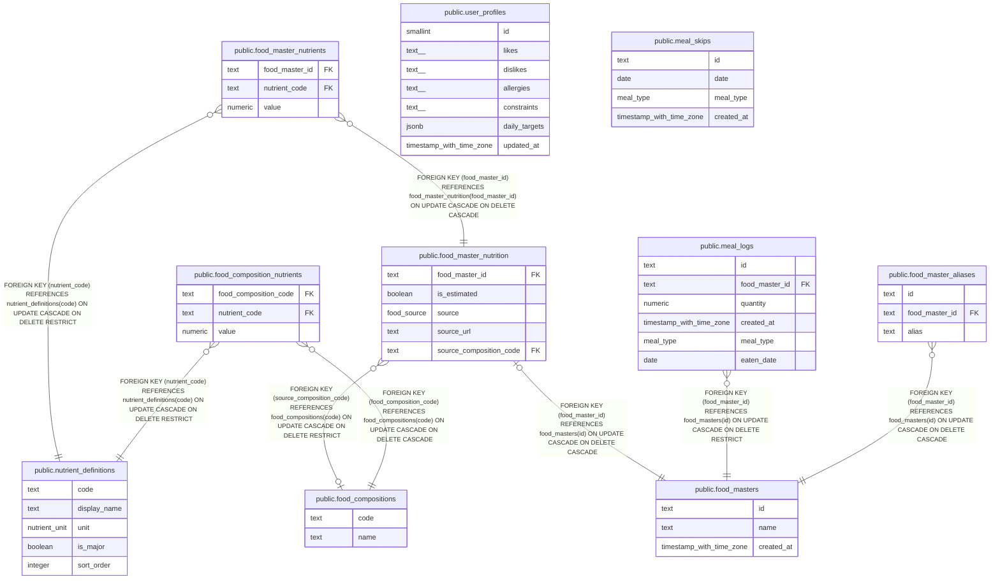

# meshi

## Tables

| Name                                                                      | Columns | Comment                                                                 | Type       |
| ------------------------------------------------------------------------- | ------- | ----------------------------------------------------------------------- | ---------- |
| [public.food_composition_nutrients](public.food_composition_nutrients.md) | 3       | Nutrient values for MEXT food composition entries.                      | BASE TABLE |
| [public.food_compositions](public.food_compositions.md)                   | 2       | MEXT food composition reference entries.                                | BASE TABLE |
| [public.food_master_aliases](public.food_master_aliases.md)               | 3       | Alternate names used to find food master entries.                       | BASE TABLE |
| [public.food_master_nutrients](public.food_master_nutrients.md)           | 3       | Nutrient values associated with registered foods.                       | BASE TABLE |
| [public.food_masters](public.food_masters.md)                             | 3       | Foods available for meal logging.                                       | BASE TABLE |
| [public.meal_logs](public.meal_logs.md)                                   | 6       | Recorded food consumption entries.                                      | BASE TABLE |
| [public.nutrient_definitions](public.nutrient_definitions.md)             | 5       | Catalog of nutrient codes, names, units, and display ordering.          | BASE TABLE |
| [public.user_profiles](public.user_profiles.md)                           | 7       | The singleton user profile for preferences and daily nutrition targets. | BASE TABLE |
| [public.meal_skips](public.meal_skips.md)                                 | 4       | Meals marked as skipped for a date and meal type.                       | BASE TABLE |
| [public.food_master_nutrition](public.food_master_nutrition.md)           | 5       | Nutrition source and estimation metadata for a food master.             | BASE TABLE |

## Stored procedures and functions

| Name                                             | ReturnType | Arguments                                                                 | Type     |
| ------------------------------------------------ | ---------- | ------------------------------------------------------------------------- | -------- |
| public.set_limit                                 | float4     | real                                                                      | FUNCTION |
| public.show_limit                                | float4     |                                                                           | FUNCTION |
| public.show_trgm                                 | _text      | text                                                                      | FUNCTION |
| public.similarity                                | float4     | text, text                                                                | FUNCTION |
| public.similarity_op                             | bool       | text, text                                                                | FUNCTION |
| public.word_similarity                           | float4     | text, text                                                                | FUNCTION |
| public.word_similarity_op                        | bool       | text, text                                                                | FUNCTION |
| public.word_similarity_commutator_op             | bool       | text, text                                                                | FUNCTION |
| public.similarity_dist                           | float4     | text, text                                                                | FUNCTION |
| public.word_similarity_dist_op                   | float4     | text, text                                                                | FUNCTION |
| public.word_similarity_dist_commutator_op        | float4     | text, text                                                                | FUNCTION |
| public.gtrgm_in                                  | gtrgm      | cstring                                                                   | FUNCTION |
| public.gtrgm_out                                 | cstring    | gtrgm                                                                     | FUNCTION |
| public.gtrgm_consistent                          | bool       | internal, text, smallint, oid, internal                                   | FUNCTION |
| public.gtrgm_distance                            | float8     | internal, text, smallint, oid, internal                                   | FUNCTION |
| public.gtrgm_compress                            | internal   | internal                                                                  | FUNCTION |
| public.gtrgm_decompress                          | internal   | internal                                                                  | FUNCTION |
| public.gtrgm_penalty                             | internal   | internal, internal, internal                                              | FUNCTION |
| public.gtrgm_picksplit                           | internal   | internal, internal                                                        | FUNCTION |
| public.gtrgm_union                               | gtrgm      | internal, internal                                                        | FUNCTION |
| public.gtrgm_same                                | internal   | gtrgm, gtrgm, internal                                                    | FUNCTION |
| public.gin_extract_value_trgm                    | internal   | text, internal                                                            | FUNCTION |
| public.gin_extract_query_trgm                    | internal   | text, internal, smallint, internal, internal, internal, internal          | FUNCTION |
| public.gin_trgm_consistent                       | bool       | internal, smallint, text, integer, internal, internal, internal, internal | FUNCTION |
| public.gin_trgm_triconsistent                    | char       | internal, smallint, text, integer, internal, internal, internal           | FUNCTION |
| public.strict_word_similarity                    | float4     | text, text                                                                | FUNCTION |
| public.strict_word_similarity_op                 | bool       | text, text                                                                | FUNCTION |
| public.strict_word_similarity_commutator_op      | bool       | text, text                                                                | FUNCTION |
| public.strict_word_similarity_dist_op            | float4     | text, text                                                                | FUNCTION |
| public.strict_word_similarity_dist_commutator_op | float4     | text, text                                                                | FUNCTION |
| public.gtrgm_options                             | void       | internal                                                                  | FUNCTION |

## Enums

| Name                 | Values                                             |
| -------------------- | -------------------------------------------------- |
| public.food_source   | composition_table_estimate, user_input, web_search |
| public.meal_type     | breakfast, dinner, lunch, snack                    |
| public.nutrient_unit | g, kcal, mg, µg                                    |

## Relations

---

> Generated by [tbls](https://github.com/k1LoW/tbls)
