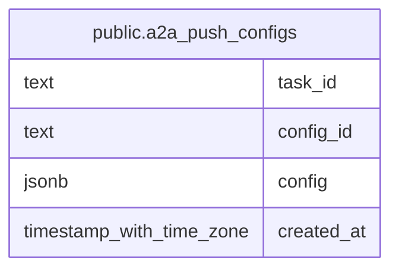

# public.a2a_push_configs

## Description

Persisted A2A push notification configurations.

## Columns

| Name       | Type                     | Default | Nullable | Children | Parents | Comment                                                                   |
| ---------- | ------------------------ | ------- | -------- | -------- | ------- | ------------------------------------------------------------------------- |
| task_id    | text                     |         | false    |          |         | A2A task identifier associated with this push notification configuration. |
| config_id  | text                     |         | false    |          |         | Push notification configuration identifier.                               |
| config     | jsonb                    |         | false    |          |         | Serialized A2A push notification configuration.                           |
| created_at | timestamp with time zone | now()   | false    |          |         |                                                                           |

## Constraints

| Name                                 | Type        | Definition                                      |
| ------------------------------------ | ----------- | ----------------------------------------------- |
| a2a_push_configs_config_id_not_null  | n           | NOT NULL config_id                              |
| a2a_push_configs_config_not_null     | n           | NOT NULL config                                 |
| a2a_push_configs_config_object       | CHECK       | CHECK ((jsonb_typeof(config) = 'object'::text)) |
| a2a_push_configs_created_at_not_null | n           | NOT NULL created_at                             |
| a2a_push_configs_task_id_not_null    | n           | NOT NULL task_id                                |
| a2a_push_configs_pkey                | PRIMARY KEY | PRIMARY KEY (task_id, config_id)                |

## Indexes

| Name                  | Definition                                                                                            |
| --------------------- | ----------------------------------------------------------------------------------------------------- |
| a2a_push_configs_pkey | CREATE UNIQUE INDEX a2a_push_configs_pkey ON public.a2a_push_configs USING btree (task_id, config_id) |

## Relations

---

> Generated by [tbls](https://github.com/k1LoW/tbls)
