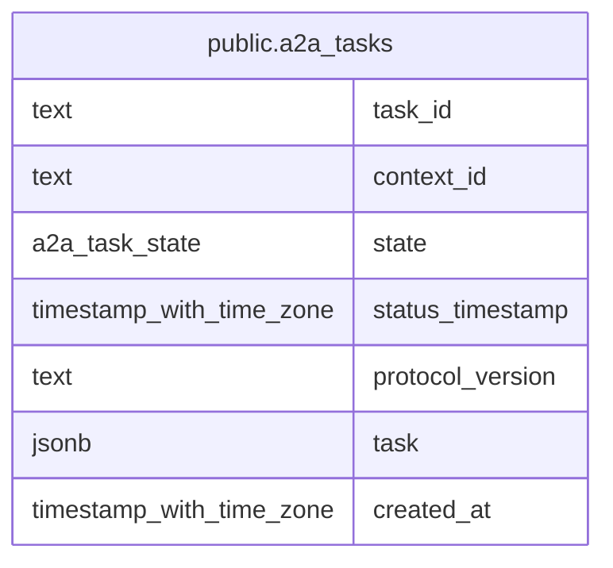

# public.a2a_tasks

## Description

Persisted A2A tasks used for task retrieval and lifecycle management.

## Columns

| Name             | Type                     | Default     | Nullable | Children | Parents | Comment                                                                     |
| ---------------- | ------------------------ | ----------- | -------- | -------- | ------- | --------------------------------------------------------------------------- |
| task_id          | text                     |             | false    |          |         | A2A task identifier.                                                        |
| context_id       | text                     |             | false    |          |         | Context identifier from the A2A task.                                       |
| state            | a2a_task_state           |             | false    |          |         | Current state of the A2A task.                                              |
| status_timestamp | timestamp with time zone |             | false    |          |         | Timestamp of the latest known task status update, used by lifecycle sweeps. |
| protocol_version | text                     | '0.3'::text | false    |          |         | Stored A2A protocol version; defaults to 0.3.                               |
| task             | jsonb                    |             | false    |          |         | Serialized A2A Task object.                                                 |
| created_at       | timestamp with time zone | now()       | false    |          |         |                                                                             |

## Constraints

| Name                                | Type        | Definition                                    |
| ----------------------------------- | ----------- | --------------------------------------------- |
| a2a_tasks_context_id_not_null       | n           | NOT NULL context_id                           |
| a2a_tasks_created_at_not_null       | n           | NOT NULL created_at                           |
| a2a_tasks_protocol_version_not_null | n           | NOT NULL protocol_version                     |
| a2a_tasks_state_not_null            | n           | NOT NULL state                                |
| a2a_tasks_status_timestamp_not_null | n           | NOT NULL status_timestamp                     |
| a2a_tasks_task_id_not_null          | n           | NOT NULL task_id                              |
| a2a_tasks_task_not_null             | n           | NOT NULL task                                 |
| a2a_tasks_task_object               | CHECK       | CHECK ((jsonb_typeof(task) = 'object'::text)) |
| a2a_tasks_pkey                      | PRIMARY KEY | PRIMARY KEY (task_id)                         |

## Indexes

| Name                  | Definition                                                                                 |
| --------------------- | ------------------------------------------------------------------------------------------ |
| a2a_tasks_pkey        | CREATE UNIQUE INDEX a2a_tasks_pkey ON public.a2a_tasks USING btree (task_id)               |
| a2a_tasks_context_idx | CREATE INDEX a2a_tasks_context_idx ON public.a2a_tasks USING btree (context_id)            |
| a2a_tasks_sweep_idx   | CREATE INDEX a2a_tasks_sweep_idx ON public.a2a_tasks USING btree (state, status_timestamp) |

## Relations

---

> Generated by [tbls](https://github.com/k1LoW/tbls)
