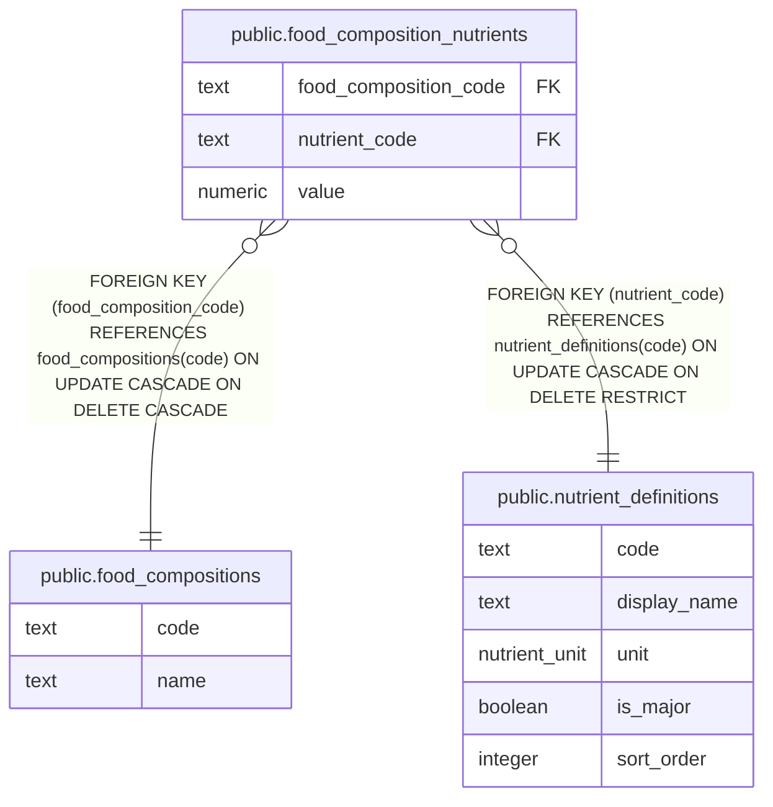

# public.food_composition_nutrients

## Description

Nutrient values for MEXT food composition entries.

## Columns

| Name                  | Type    | Default | Nullable | Children | Parents                                                       | Comment                                                            |
| --------------------- | ------- | ------- | -------- | -------- | ------------------------------------------------------------- | ------------------------------------------------------------------ |
| food_composition_code | text    |         | false    |          | [public.food_compositions](public.food_compositions.md)       | Code of the food composition entry this nutrient value belongs to. |
| nutrient_code         | text    |         | false    |          | [public.nutrient_definitions](public.nutrient_definitions.md) | Identifier of the nutrient.                                        |
| value                 | numeric |         | false    |          |                                                               | Nutrient value per 100 g of the food composition entry.            |

## Constraints

| Name                                                      | Type        | Definition                                                                                                 |
| --------------------------------------------------------- | ----------- | ---------------------------------------------------------------------------------------------------------- |
| food_composition_nutrients_food_composition_code_not_null | n           | NOT NULL food_composition_code                                                                             |
| food_composition_nutrients_nutrient_code_not_null         | n           | NOT NULL nutrient_code                                                                                     |
| food_composition_nutrients_value_nonneg                   | CHECK       | CHECK ((value >= (0)::numeric))                                                                            |
| food_composition_nutrients_value_not_null                 | n           | NOT NULL value                                                                                             |
| food_composition_nutrients_pkey                           | PRIMARY KEY | PRIMARY KEY (food_composition_code, nutrient_code)                                                         |
| food_composition_nutrients_food_composition_code_fk       | FOREIGN KEY | FOREIGN KEY (food_composition_code) REFERENCES food_compositions(code) ON UPDATE CASCADE ON DELETE CASCADE |
| food_composition_nutrients_nutrient_code_fk               | FOREIGN KEY | FOREIGN KEY (nutrient_code) REFERENCES nutrient_definitions(code) ON UPDATE CASCADE ON DELETE RESTRICT     |

## Indexes

| Name                                         | Definition                                                                                                                                  |
| -------------------------------------------- | ------------------------------------------------------------------------------------------------------------------------------------------- |
| food_composition_nutrients_pkey              | CREATE UNIQUE INDEX food_composition_nutrients_pkey ON public.food_composition_nutrients USING btree (food_composition_code, nutrient_code) |
| food_composition_nutrients_nutrient_code_idx | CREATE INDEX food_composition_nutrients_nutrient_code_idx ON public.food_composition_nutrients USING btree (nutrient_code)                  |

## Relations

---

> Generated by [tbls](https://github.com/k1LoW/tbls)
