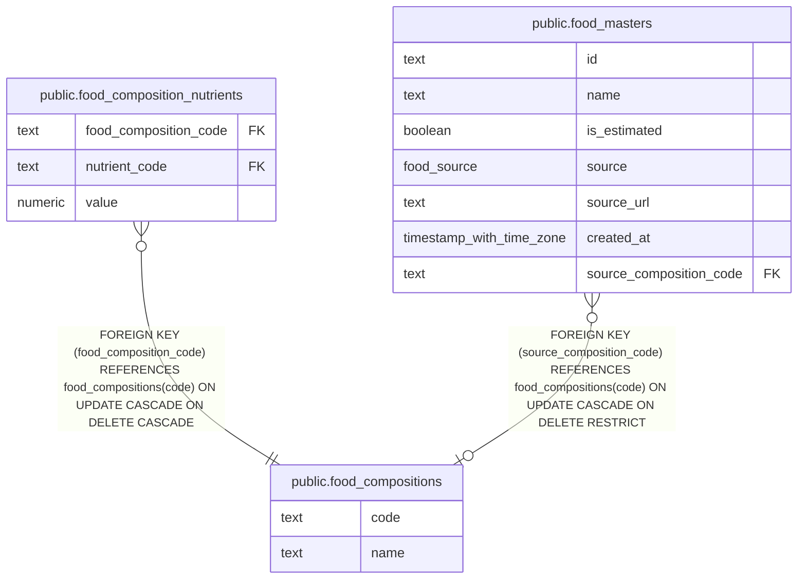

# public.food_compositions

## Description

MEXT food composition reference entries.

## Columns

| Name | Type | Default | Nullable | Children                                                                                                                | Parents | Comment                                  |
| ---- | ---- | ------- | -------- | ----------------------------------------------------------------------------------------------------------------------- | ------- | ---------------------------------------- |
| code | text |         | false    | [public.food_composition_nutrients](public.food_composition_nutrients.md) [public.food_masters](public.food_masters.md) |         | MEXT food composition entry code.        |
| name | text |         | false    |                                                                                                                         |         | Name of the MEXT food composition entry. |

## Constraints

| Name                            | Type        | Definition         |
| ------------------------------- | ----------- | ------------------ |
| food_compositions_code_not_null | n           | NOT NULL code      |
| food_compositions_name_not_null | n           | NOT NULL name      |
| food_compositions_pkey          | PRIMARY KEY | PRIMARY KEY (code) |

## Indexes

| Name                            | Definition                                                                                             |
| ------------------------------- | ------------------------------------------------------------------------------------------------------ |
| food_compositions_pkey          | CREATE UNIQUE INDEX food_compositions_pkey ON public.food_compositions USING btree (code)              |
| food_compositions_name_idx      | CREATE INDEX food_compositions_name_idx ON public.food_compositions USING btree (name)                 |
| food_compositions_name_trgm_idx | CREATE INDEX food_compositions_name_trgm_idx ON public.food_compositions USING gin (name gin_trgm_ops) |

## Relations

---

> Generated by [tbls](https://github.com/k1LoW/tbls)
