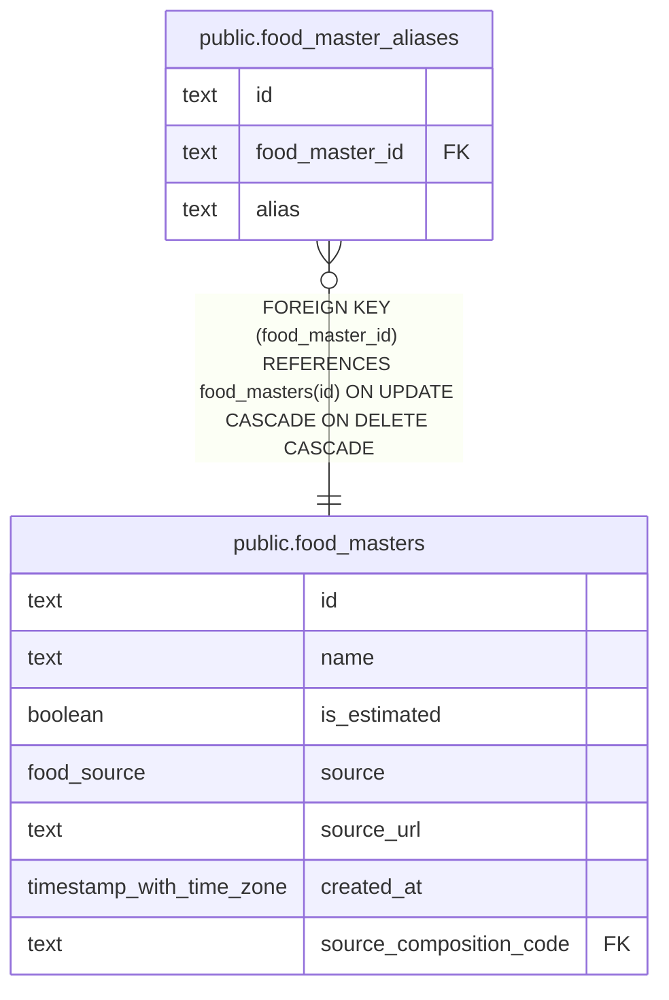

# public.food_master_aliases

## Description

Alternate names used to find food master entries.

## Columns

| Name           | Type | Default | Nullable | Children | Parents                                       | Comment                                              |
| -------------- | ---- | ------- | -------- | -------- | --------------------------------------------- | ---------------------------------------------------- |
| id             | text |         | false    |          |                                               |                                                      |
| food_master_id | text |         | false    |          | [public.food_masters](public.food_masters.md) | Identifier of the food master this alias belongs to. |
| alias          | text |         | false    |          |                                               | Alternate name used for matching a food master.      |

## Constraints

| Name                                        | Type        | Definition                                                                                   |
| ------------------------------------------- | ----------- | -------------------------------------------------------------------------------------------- |
| food_master_aliases_alias_not_null          | n           | NOT NULL alias                                                                               |
| food_master_aliases_food_master_id_not_null | n           | NOT NULL food_master_id                                                                      |
| food_master_aliases_id_not_null             | n           | NOT NULL id                                                                                  |
| food_master_aliases_pkey                    | PRIMARY KEY | PRIMARY KEY (id)                                                                             |
| food_master_aliases_food_master_id_fk       | FOREIGN KEY | FOREIGN KEY (food_master_id) REFERENCES food_masters(id) ON UPDATE CASCADE ON DELETE CASCADE |

## Indexes

| Name                                   | Definition                                                                                                     |
| -------------------------------------- | -------------------------------------------------------------------------------------------------------------- |
| food_master_aliases_pkey               | CREATE UNIQUE INDEX food_master_aliases_pkey ON public.food_master_aliases USING btree (id)                    |
| food_master_aliases_alias_key          | CREATE UNIQUE INDEX food_master_aliases_alias_key ON public.food_master_aliases USING btree (alias)            |
| food_master_aliases_food_master_id_idx | CREATE INDEX food_master_aliases_food_master_id_idx ON public.food_master_aliases USING btree (food_master_id) |
| food_master_aliases_alias_trgm_idx     | CREATE INDEX food_master_aliases_alias_trgm_idx ON public.food_master_aliases USING gin (alias gin_trgm_ops)   |

## Relations

---

> Generated by [tbls](https://github.com/k1LoW/tbls)
