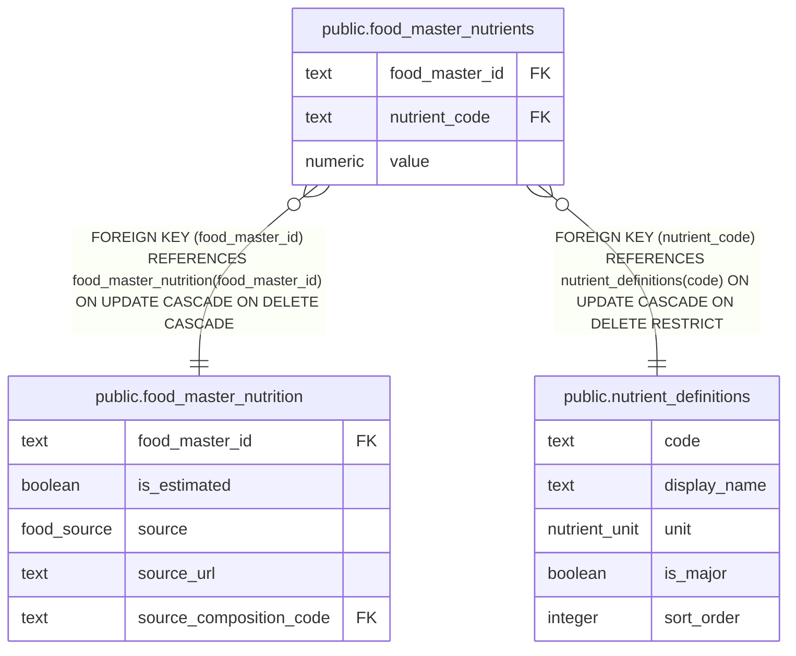

# public.food_master_nutrients

## Description

Nutrient values associated with registered foods.

## Columns

| Name           | Type    | Default | Nullable | Children | Parents                                                         | Comment                                                               |
| -------------- | ------- | ------- | -------- | -------- | --------------------------------------------------------------- | --------------------------------------------------------------------- |
| food_master_id | text    |         | false    |          | [public.food_master_nutrition](public.food_master_nutrition.md) | Identifier of the food master this nutrient value belongs to.         |
| nutrient_code  | text    |         | false    |          | [public.nutrient_definitions](public.nutrient_definitions.md)   | Identifier of the nutrient.                                           |
| value          | numeric |         | false    |          |                                                                 | Nutrient value for the food master; its quantity basis is not stored. |

## Constraints

| Name                                          | Type        | Definition                                                                                                        |
| --------------------------------------------- | ----------- | ----------------------------------------------------------------------------------------------------------------- |
| food_master_nutrients_food_master_id_not_null | n           | NOT NULL food_master_id                                                                                           |
| food_master_nutrients_nutrient_code_not_null  | n           | NOT NULL nutrient_code                                                                                            |
| food_master_nutrients_value_nonneg            | CHECK       | CHECK ((value >= (0)::numeric))                                                                                   |
| food_master_nutrients_value_not_null          | n           | NOT NULL value                                                                                                    |
| food_master_nutrients_pkey                    | PRIMARY KEY | PRIMARY KEY (food_master_id, nutrient_code)                                                                       |
| food_master_nutrients_nutrient_code_fk        | FOREIGN KEY | FOREIGN KEY (nutrient_code) REFERENCES nutrient_definitions(code) ON UPDATE CASCADE ON DELETE RESTRICT            |
| food_master_nutrients_food_master_id_fk       | FOREIGN KEY | FOREIGN KEY (food_master_id) REFERENCES food_master_nutrition(food_master_id) ON UPDATE CASCADE ON DELETE CASCADE |

## Indexes

| Name                                    | Definition                                                                                                                 |
| --------------------------------------- | -------------------------------------------------------------------------------------------------------------------------- |
| food_master_nutrients_pkey              | CREATE UNIQUE INDEX food_master_nutrients_pkey ON public.food_master_nutrients USING btree (food_master_id, nutrient_code) |
| food_master_nutrients_nutrient_code_idx | CREATE INDEX food_master_nutrients_nutrient_code_idx ON public.food_master_nutrients USING btree (nutrient_code)           |

## Relations

---

> Generated by [tbls](https://github.com/k1LoW/tbls)
