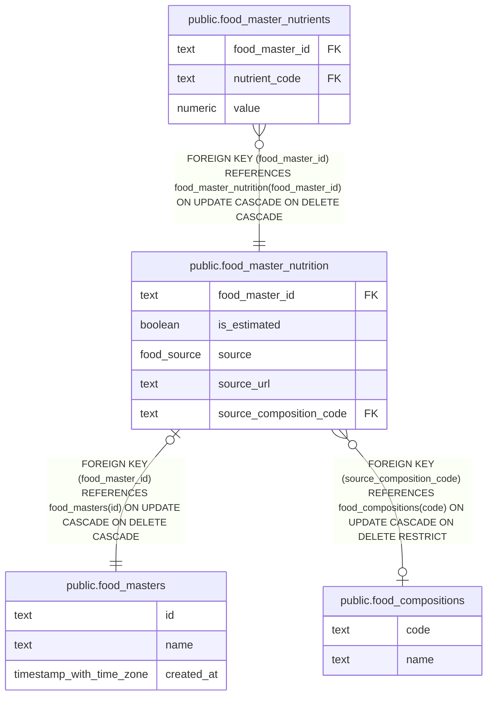

# public.food_master_nutrition

## Description

Nutrition source and estimation metadata for a food master.

## Columns

| Name                    | Type        | Default | Nullable | Children                                                        | Parents                                                 | Comment                                                                            |
| ----------------------- | ----------- | ------- | -------- | --------------------------------------------------------------- | ------------------------------------------------------- | ---------------------------------------------------------------------------------- |
| food_master_id          | text        |         | false    | [public.food_master_nutrients](public.food_master_nutrients.md) | [public.food_masters](public.food_masters.md)           | Identifier of the food master this nutrition metadata belongs to.                  |
| is_estimated            | boolean     | false   | false    |                                                                 |                                                         | Whether the nutrition values are estimated.                                        |
| source                  | food_source |         | false    |                                                                 |                                                         | Origin of the nutrition values: web search, food composition table, or user input. |
| source_url              | text        |         | true     |                                                                 |                                                         | URL of the web page used as evidence for the nutrition values.                     |
| source_composition_code | text        |         | true     |                                                                 | [public.food_compositions](public.food_compositions.md) | Code of the food composition entry used as evidence.                               |

## Constraints

| Name                                             | Type        | Definition                                                                                                                                                              |
| ------------------------------------------------ | ----------- | ----------------------------------------------------------------------------------------------------------------------------------------------------------------------- |
| food_master_nutrition_composition_evidence       | CHECK       | CHECK (((source <> 'composition_table_estimate'::food_source) OR ((is_estimated = true) AND (source_url IS NULL) AND (source_composition_code IS NOT NULL)))) NOT VALID |
| food_master_nutrition_food_master_id_not_null    | n           | NOT NULL food_master_id                                                                                                                                                 |
| food_master_nutrition_is_estimated_not_null      | n           | NOT NULL is_estimated                                                                                                                                                   |
| food_master_nutrition_source_not_null            | n           | NOT NULL source                                                                                                                                                         |
| food_master_nutrition_user_input_evidence        | CHECK       | CHECK (((source <> 'user_input'::food_source) OR ((source_url IS NULL) AND (source_composition_code IS NULL)))) NOT VALID                                               |
| food_master_nutrition_web_search_evidence        | CHECK       | CHECK (((source <> 'web_search'::food_source) OR ((is_estimated = false) AND (source_url IS NOT NULL) AND (source_composition_code IS NULL)))) NOT VALID                |
| food_master_nutrition_source_composition_code_fk | FOREIGN KEY | FOREIGN KEY (source_composition_code) REFERENCES food_compositions(code) ON UPDATE CASCADE ON DELETE RESTRICT                                                           |
| food_master_nutrition_food_master_id_fk          | FOREIGN KEY | FOREIGN KEY (food_master_id) REFERENCES food_masters(id) ON UPDATE CASCADE ON DELETE CASCADE                                                                            |
| food_master_nutrition_pkey                       | PRIMARY KEY | PRIMARY KEY (food_master_id)                                                                                                                                            |

## Indexes

| Name                                              | Definition                                                                                                                                 |
| ------------------------------------------------- | ------------------------------------------------------------------------------------------------------------------------------------------ |
| food_master_nutrition_pkey                        | CREATE UNIQUE INDEX food_master_nutrition_pkey ON public.food_master_nutrition USING btree (food_master_id)                                |
| food_master_nutrition_is_estimated_idx            | CREATE INDEX food_master_nutrition_is_estimated_idx ON public.food_master_nutrition USING btree (is_estimated) WHERE (is_estimated = true) |
| food_master_nutrition_source_composition_code_idx | CREATE INDEX food_master_nutrition_source_composition_code_idx ON public.food_master_nutrition USING btree (source_composition_code)       |

## Relations

---

> Generated by [tbls](https://github.com/k1LoW/tbls)
