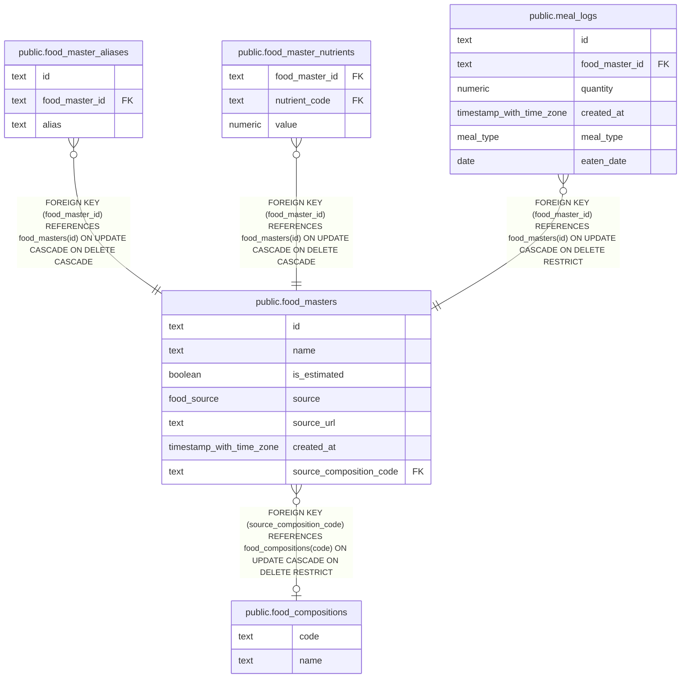

# public.food_masters

## Description

Foods available for meal logging, with nutrition-source and estimation metadata.

## Columns

| Name                    | Type                     | Default | Nullable | Children                                                                                                                                                            | Parents                                                 | Comment                                                                            |
| ----------------------- | ------------------------ | ------- | -------- | ------------------------------------------------------------------------------------------------------------------------------------------------------------------- | ------------------------------------------------------- | ---------------------------------------------------------------------------------- |
| id                      | text                     |         | false    | [public.food_master_aliases](public.food_master_aliases.md) [public.food_master_nutrients](public.food_master_nutrients.md) [public.meal_logs](public.meal_logs.md) |                                                         |                                                                                    |
| name                    | text                     |         | false    |                                                                                                                                                                     |                                                         | Food name.                                                                         |
| is_estimated            | boolean                  | false   | false    |                                                                                                                                                                     |                                                         | Whether the nutrition values are estimated.                                        |
| source                  | food_source              |         | false    |                                                                                                                                                                     |                                                         | Origin of the nutrition values: web search, food composition table, or user input. |
| source_url              | text                     |         | true     |                                                                                                                                                                     |                                                         | URL of the web page used as evidence for the nutrition values.                     |
| created_at              | timestamp with time zone | now()   | false    |                                                                                                                                                                     |                                                         |                                                                                    |
| source_composition_code | text                     |         | true     |                                                                                                                                                                     | [public.food_compositions](public.food_compositions.md) | Code of the food composition entry used to register the food.                      |

## Constraints

| Name                                    | Type        | Definition                                                                                                                                                              |
| --------------------------------------- | ----------- | ----------------------------------------------------------------------------------------------------------------------------------------------------------------------- |
| food_masters_composition_evidence       | CHECK       | CHECK (((source <> 'composition_table_estimate'::food_source) OR ((is_estimated = true) AND (source_url IS NULL) AND (source_composition_code IS NOT NULL)))) NOT VALID |
| food_masters_created_at_not_null        | n           | NOT NULL created_at                                                                                                                                                     |
| food_masters_id_not_null                | n           | NOT NULL id                                                                                                                                                             |
| food_masters_is_estimated_not_null      | n           | NOT NULL is_estimated                                                                                                                                                   |
| food_masters_name_not_null              | n           | NOT NULL name                                                                                                                                                           |
| food_masters_source_not_null            | n           | NOT NULL source                                                                                                                                                         |
| food_masters_user_input_evidence        | CHECK       | CHECK (((source <> 'user_input'::food_source) OR ((source_url IS NULL) AND (source_composition_code IS NULL)))) NOT VALID                                               |
| food_masters_web_search_evidence        | CHECK       | CHECK (((source <> 'web_search'::food_source) OR ((is_estimated = false) AND (source_url IS NOT NULL) AND (source_composition_code IS NULL)))) NOT VALID                |
| food_masters_source_composition_code_fk | FOREIGN KEY | FOREIGN KEY (source_composition_code) REFERENCES food_compositions(code) ON UPDATE CASCADE ON DELETE RESTRICT                                                           |
| food_masters_pkey                       | PRIMARY KEY | PRIMARY KEY (id)                                                                                                                                                        |

## Indexes

| Name                                     | Definition                                                                                                               |
| ---------------------------------------- | ------------------------------------------------------------------------------------------------------------------------ |
| food_masters_pkey                        | CREATE UNIQUE INDEX food_masters_pkey ON public.food_masters USING btree (id)                                            |
| food_masters_name_key                    | CREATE UNIQUE INDEX food_masters_name_key ON public.food_masters USING btree (name)                                      |
| food_masters_is_estimated_idx            | CREATE INDEX food_masters_is_estimated_idx ON public.food_masters USING btree (is_estimated) WHERE (is_estimated = true) |
| food_masters_name_trgm_idx               | CREATE INDEX food_masters_name_trgm_idx ON public.food_masters USING gin (name gin_trgm_ops)                             |
| food_masters_source_composition_code_idx | CREATE INDEX food_masters_source_composition_code_idx ON public.food_masters USING btree (source_composition_code)       |

## Relations

---

> Generated by [tbls](https://github.com/k1LoW/tbls)
