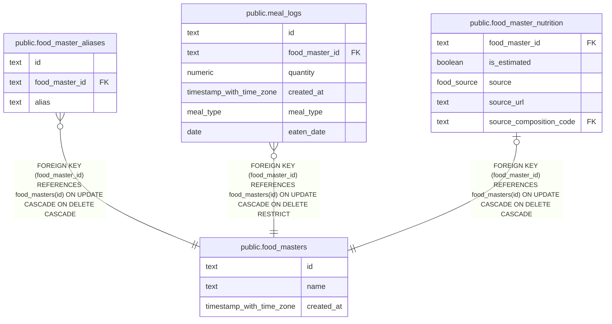

# public.food_masters

## Description

Foods available for meal logging.

## Columns

| Name       | Type                     | Default | Nullable | Children                                                                                                                                                            | Parents | Comment    |
| ---------- | ------------------------ | ------- | -------- | ------------------------------------------------------------------------------------------------------------------------------------------------------------------- | ------- | ---------- |
| id         | text                     |         | false    | [public.food_master_aliases](public.food_master_aliases.md) [public.meal_logs](public.meal_logs.md) [public.food_master_nutrition](public.food_master_nutrition.md) |         |            |
| name       | text                     |         | false    |                                                                                                                                                                     |         | Food name. |
| created_at | timestamp with time zone | now()   | false    |                                                                                                                                                                     |         |            |

## Constraints

| Name                             | Type        | Definition          |
| -------------------------------- | ----------- | ------------------- |
| food_masters_created_at_not_null | n           | NOT NULL created_at |
| food_masters_id_not_null         | n           | NOT NULL id         |
| food_masters_name_not_null       | n           | NOT NULL name       |
| food_masters_pkey                | PRIMARY KEY | PRIMARY KEY (id)    |

## Indexes

| Name                       | Definition                                                                                   |
| -------------------------- | -------------------------------------------------------------------------------------------- |
| food_masters_pkey          | CREATE UNIQUE INDEX food_masters_pkey ON public.food_masters USING btree (id)                |
| food_masters_name_key      | CREATE UNIQUE INDEX food_masters_name_key ON public.food_masters USING btree (name)          |
| food_masters_name_trgm_idx | CREATE INDEX food_masters_name_trgm_idx ON public.food_masters USING gin (name gin_trgm_ops) |

## Relations

---

> Generated by [tbls](https://github.com/k1LoW/tbls)
