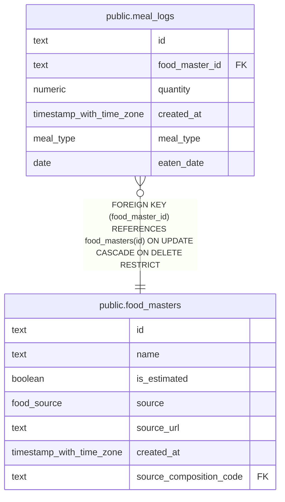

# public.meal_logs

## Description

Recorded food consumption entries.

## Columns

| Name           | Type                     | Default | Nullable | Children | Parents                                       | Comment                                                  |
| -------------- | ------------------------ | ------- | -------- | -------- | --------------------------------------------- | -------------------------------------------------------- |
| id             | text                     |         | false    |          |                                               |                                                          |
| food_master_id | text                     |         | false    |          | [public.food_masters](public.food_masters.md) | Identifier of the food recorded in this meal log.        |
| quantity       | numeric                  |         | false    |          |                                               | Multiplier applied to the food master's nutrient values. |
| created_at     | timestamp with time zone | now()   | false    |          |                                               |                                                          |
| meal_type      | meal_type                |         | false    |          |                                               | Meal category: breakfast, lunch, dinner, or snack.       |
| eaten_date     | date                     |         | false    |          |                                               | Asia/Tokyo calendar date on which the food was eaten.    |

## Constraints

| Name                              | Type        | Definition                                                                                    |
| --------------------------------- | ----------- | --------------------------------------------------------------------------------------------- |
| meal_logs_created_at_not_null     | n           | NOT NULL created_at                                                                           |
| meal_logs_eaten_date_not_null     | n           | NOT NULL eaten_date                                                                           |
| meal_logs_food_master_id_not_null | n           | NOT NULL food_master_id                                                                       |
| meal_logs_id_not_null             | n           | NOT NULL id                                                                                   |
| meal_logs_meal_type_not_null1     | n           | NOT NULL meal_type                                                                            |
| meal_logs_quantity_not_null       | n           | NOT NULL quantity                                                                             |
| meal_logs_quantity_positive       | CHECK       | CHECK ((quantity > (0)::numeric))                                                             |
| meal_logs_food_master_id_fk       | FOREIGN KEY | FOREIGN KEY (food_master_id) REFERENCES food_masters(id) ON UPDATE CASCADE ON DELETE RESTRICT |
| meal_logs_pkey                    | PRIMARY KEY | PRIMARY KEY (id)                                                                              |

## Indexes

| Name                                    | Definition                                                                                                                        |
| --------------------------------------- | --------------------------------------------------------------------------------------------------------------------------------- |
| meal_logs_pkey                          | CREATE UNIQUE INDEX meal_logs_pkey ON public.meal_logs USING btree (id)                                                           |
| meal_logs_eaten_date_idx                | CREATE INDEX meal_logs_eaten_date_idx ON public.meal_logs USING btree (eaten_date DESC NULLS LAST)                                |
| meal_logs_food_master_id_eaten_date_idx | CREATE INDEX meal_logs_food_master_id_eaten_date_idx ON public.meal_logs USING btree (food_master_id, eaten_date DESC NULLS LAST) |

## Relations

---

> Generated by [tbls](https://github.com/k1LoW/tbls)
