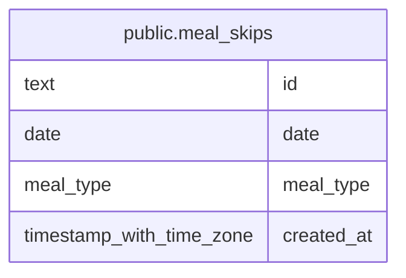

# public.meal_skips

## Description

Meals marked as skipped for a date and meal type.

## Columns

| Name       | Type                     | Default | Nullable | Children | Parents | Comment                                        |
| ---------- | ------------------------ | ------- | -------- | -------- | ------- | ---------------------------------------------- |
| id         | text                     |         | false    |          |         | Opaque identifier exposed in API responses.    |
| date       | date                     |         | false    |          |         | Asia/Tokyo calendar date for the skipped meal. |
| meal_type  | meal_type                |         | false    |          |         | Meal category marked as skipped.               |
| created_at | timestamp with time zone | now()   | false    |          |         |                                                |

## Constraints

| Name                           | Type        | Definition                    |
| ------------------------------ | ----------- | ----------------------------- |
| meal_skips_created_at_not_null | n           | NOT NULL created_at           |
| meal_skips_date_not_null       | n           | NOT NULL date                 |
| meal_skips_id_not_null         | n           | NOT NULL id                   |
| meal_skips_meal_type_not_null  | n           | NOT NULL meal_type            |
| meal_skips_pkey                | PRIMARY KEY | PRIMARY KEY (date, meal_type) |

## Indexes

| Name              | Definition                                                                             |
| ----------------- | -------------------------------------------------------------------------------------- |
| meal_skips_pkey   | CREATE UNIQUE INDEX meal_skips_pkey ON public.meal_skips USING btree (date, meal_type) |
| meal_skips_id_key | CREATE UNIQUE INDEX meal_skips_id_key ON public.meal_skips USING btree (id)            |

## Relations

---

> Generated by [tbls](https://github.com/k1LoW/tbls)
