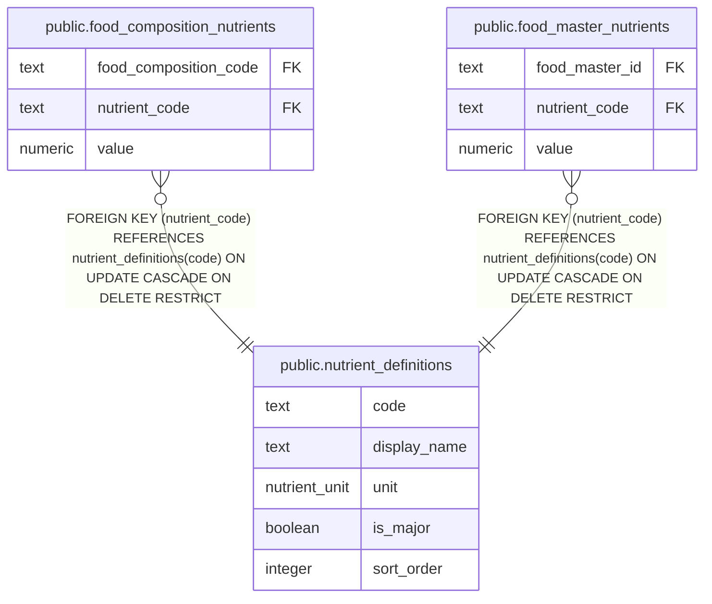

# public.nutrient_definitions

## Description

Catalog of nutrient codes, names, units, and display ordering.

## Columns

| Name         | Type          | Default | Nullable | Children                                                                                                                                  | Parents | Comment                                                    |
| ------------ | ------------- | ------- | -------- | ----------------------------------------------------------------------------------------------------------------------------------------- | ------- | ---------------------------------------------------------- |
| code         | text          |         | false    | [public.food_composition_nutrients](public.food_composition_nutrients.md) [public.food_master_nutrients](public.food_master_nutrients.md) |         | Identifier for the nutrient.                               |
| display_name | text          |         | false    |                                                                                                                                           |         | Human-readable nutrient name.                              |
| unit         | nutrient_unit |         | false    |                                                                                                                                           |         | Unit used for values of this nutrient.                     |
| is_major     | boolean       | false   | false    |                                                                                                                                           |         | Whether this nutrient belongs to the major nutrient group. |
| sort_order   | integer       | 0       | false    |                                                                                                                                           |         | Display order within the major or minor nutrient group.    |

## Constraints

| Name                                       | Type        | Definition            |
| ------------------------------------------ | ----------- | --------------------- |
| nutrient_definitions_code_not_null         | n           | NOT NULL code         |
| nutrient_definitions_display_name_not_null | n           | NOT NULL display_name |
| nutrient_definitions_is_major_not_null     | n           | NOT NULL is_major     |
| nutrient_definitions_sort_order_not_null   | n           | NOT NULL sort_order   |
| nutrient_definitions_unit_not_null         | n           | NOT NULL unit         |
| nutrient_definitions_pkey                  | PRIMARY KEY | PRIMARY KEY (code)    |

## Indexes

| Name                                | Definition                                                                                                                                 |
| ----------------------------------- | ------------------------------------------------------------------------------------------------------------------------------------------ |
| nutrient_definitions_pkey           | CREATE UNIQUE INDEX nutrient_definitions_pkey ON public.nutrient_definitions USING btree (code)                                            |
| nutrient_definitions_major_sort_idx | CREATE INDEX nutrient_definitions_major_sort_idx ON public.nutrient_definitions USING btree (is_major, sort_order) WHERE (is_major = true) |

## Relations

---

> Generated by [tbls](https://github.com/k1LoW/tbls)
