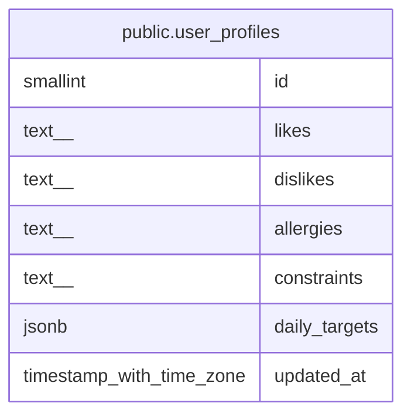

# public.user_profiles

## Description

The singleton user profile for preferences and daily nutrition targets.

## Columns

| Name          | Type                     | Default      | Nullable | Children | Parents | Comment                                               |
| ------------- | ------------------------ | ------------ | -------- | -------- | ------- | ----------------------------------------------------- |
| id            | smallint                 | 1            | false    |          |         |                                                       |
| likes         | text[]                   | '{}'::text[] | false    |          |         | Items the user likes.                                 |
| dislikes      | text[]                   | '{}'::text[] | false    |          |         | Items the user dislikes.                              |
| allergies     | text[]                   | '{}'::text[] | false    |          |         | User allergy entries.                                 |
| constraints   | text[]                   | '{}'::text[] | false    |          |         | User dietary constraint entries.                      |
| daily_targets | jsonb                    |              | true     |          |         | Daily nutrition target values keyed by nutrient code. |
| updated_at    | timestamp with time zone | now()        | false    |          |         |                                                       |

## Constraints

| Name                               | Type        | Definition                                                                          |
| ---------------------------------- | ----------- | ----------------------------------------------------------------------------------- |
| user_profiles_allergies_not_null   | n           | NOT NULL allergies                                                                  |
| user_profiles_constraints_not_null | n           | NOT NULL constraints                                                                |
| user_profiles_daily_targets_object | CHECK       | CHECK (((daily_targets IS NULL) OR (jsonb_typeof(daily_targets) = 'object'::text))) |
| user_profiles_dislikes_not_null    | n           | NOT NULL dislikes                                                                   |
| user_profiles_id_not_null          | n           | NOT NULL id                                                                         |
| user_profiles_likes_not_null       | n           | NOT NULL likes                                                                      |
| user_profiles_singleton            | CHECK       | CHECK ((id = 1))                                                                    |
| user_profiles_updated_at_not_null  | n           | NOT NULL updated_at                                                                 |
| user_profiles_pkey                 | PRIMARY KEY | PRIMARY KEY (id)                                                                    |

## Indexes

| Name               | Definition                                                                      |
| ------------------ | ------------------------------------------------------------------------------- |
| user_profiles_pkey | CREATE UNIQUE INDEX user_profiles_pkey ON public.user_profiles USING btree (id) |

## Relations

---

> Generated by [tbls](https://github.com/k1LoW/tbls)
